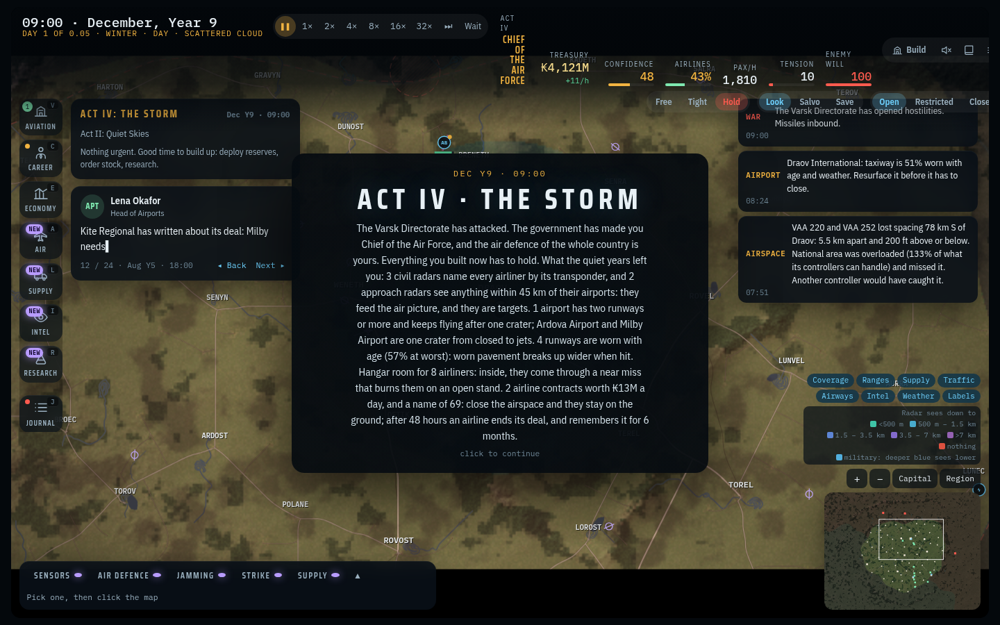
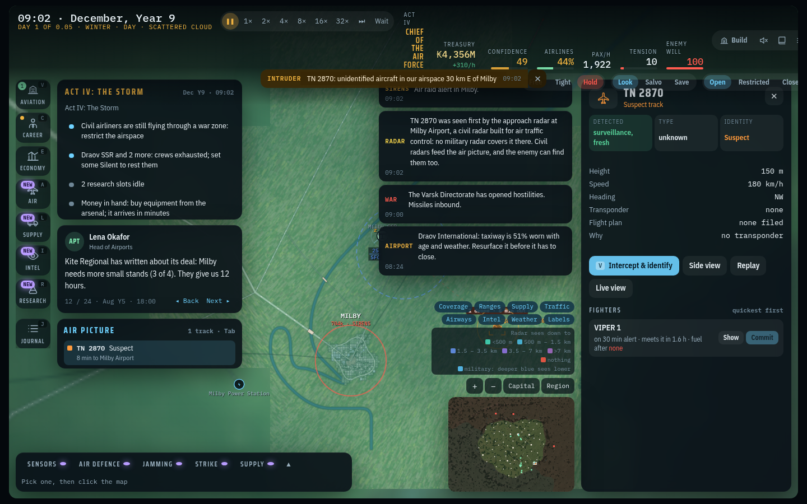
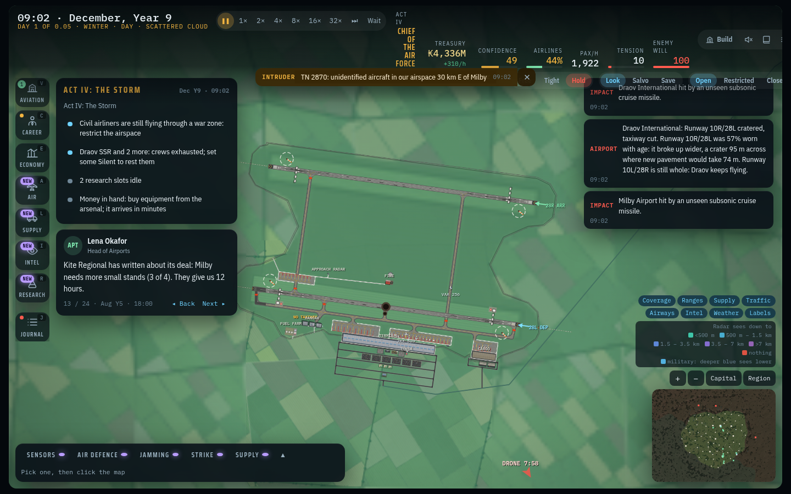
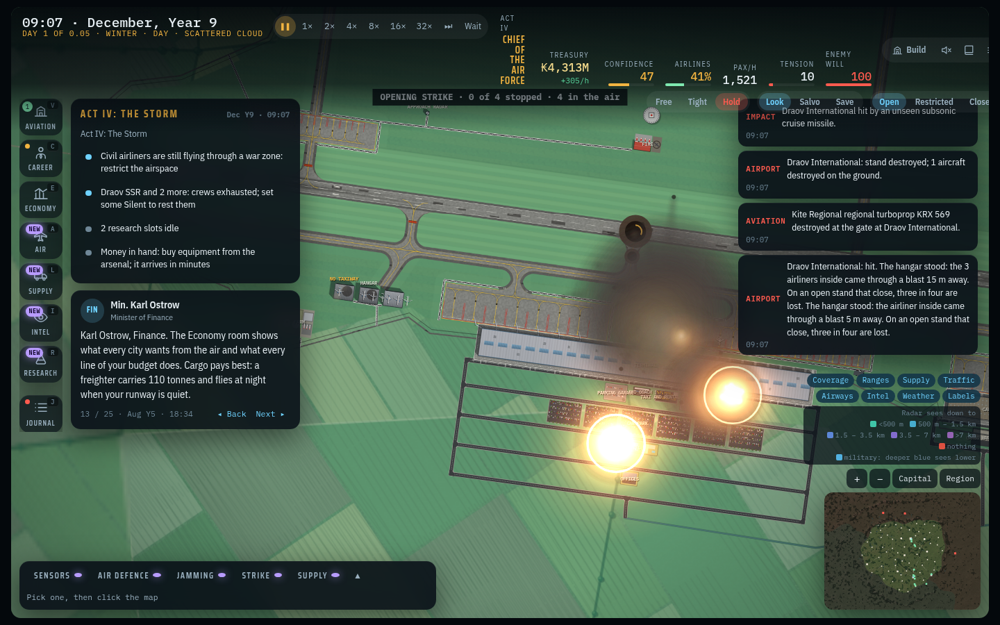
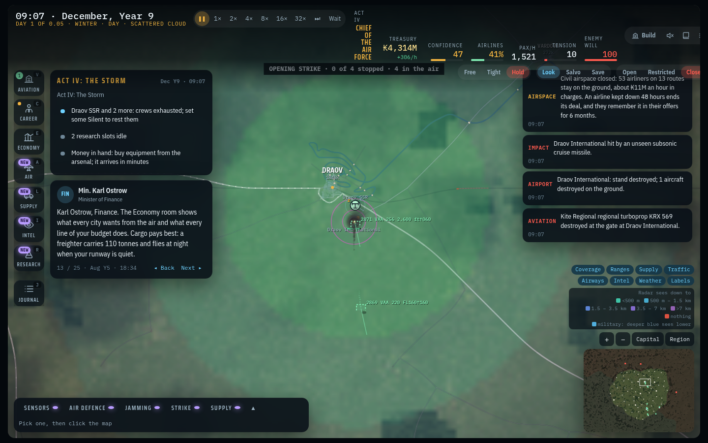

# Brief 25 play-through: three peacetime choices, and the war that judged them

Played in the page by `tools/peacewar-shots.js` (seed 777, the Career with the three starting airports, `preset: 'network'`). A plain player signs every airline offer it can and answers events with the first option. Three choices are made by the script on dated days; the years between are played out by the simulation. Then the war is started (Act IV and the enemy's opening), and a drone and three cruise missiles are placed by the script so that each choice is tested at once. The enemy's own opening strike flies at the same time.

**The calendar is compressed** (`dpm: 0.05`: a month is 72 live minutes) so that eight years pass in a few minutes. Every date below is the game's own calendar, and ageing, deals and the monthly statements ran by it. A side effect: once the war is on the live clock, one live day is 20 months on this calendar, so the war moments below are all within ten minutes of each other. For the same reason the airlines' walk-out after 48 hours, and their memory of it, are shown by the test (`peace and war: closing the airspace ...`), on the real calendar, not here.

| Date | What happened |
| --- | --- |
| June, Year 1 | Start. Draov International is the national airport; Milby Airport is 212 km from the hostile border. |
| August, Year 1 | Choice 1: an approach radar at Milby Airport. |
| March, Year 2 | Choice 2: a second runway at Draov International, 1.6 km south of the first, with two taxiways to it. |
| April, Year 3 | Choice 3: a third hangar at Draov International, beside the other two. |
| May, Year 9 | Every runway is 47–53% worn with age; none was resurfaced. Two airline deals running. |
| December, Year 9, 09:00 | War. |

## The war opens: what the quiet years left

The Act IV card now lists what peace built, in the terms the war will judge it by (`IC.peaceLedger` in `story.js`): 3 civil radars name every airliner by its transponder and 2 approach radars see anything within 45 km of their airports, and they are targets; one airport has two runways and keeps flying after a crater, while Ardova and Milby are one crater from closed to jets; four runways are worn (57% at worst) and break up wider when hit; hangar room for 8 airliners; 2 airline contracts worth ₭13M a day and a name of 69, and what closing the airspace would do to them.

## Moment 1: the approach radar built in Year 1 sees the drone (December, Year 9, 09:02)

A one-way attack drone crosses the border towards Milby at 150 m. No military radar covers that approach. Milby's approach radar, built in August of Year 1 for the controllers, sees it 30 km out, and the air picture has it with eight minutes to spare:

> TN 2870 was seen first by the approach radar at Milby Airport, a civil radar built for air traffic control: no military radar covers it there. Civil radars feed the air picture, and the enemy can find them too.

The civil beacons (secondary radars) had already named the airliners in the picture by their transponders, so the drone stood out as the one track with none ("Suspect: no transponder"). In the first run of this script the enemy's opening strike destroyed Milby's beacon outright: the civil radars are targets too.

## Moment 2: the second runway of Year 2 keeps the capital flying (December, Year 9, 09:02)

One cruise missile hits the middle of each airport's first runway. Both runways are old pavement:

> Milby Airport: Runway 18/36 cratered. Runway 18/36 was 57% worn with age: it broke up wider, a crater 95 m across where new pavement would take 74 m. With one runway, one crater closes it to airliners: the longest stretch left is 1.2 km, and they need 2.1 km. A second runway would have kept it open.

> Draov International: Runway 10R/28L cratered, taxiway cut. Runway 10R/28L was 57% worn with age: it broke up wider, a crater 95 m across where new pavement would take 74 m. Runway 10L/28R is still whole: Draov keeps flying.

Arrivals for Milby divert ("the runway is closed"); five minutes later an airliner departs Draov from Runway 10L/28R, the runway built in March of Year 2. Ageing paid off the other way: eight years of wear made each crater a quarter wider than on new pavement. Had a runway been laid in reinforced concrete, the line would read "Reinforced concrete: the crater is 51 m across, about half what asphalt would take (92 m), and it is filled in 7 min."

## Moment 3: the hangars at Draov (December, Year 9, 09:07)

An airliner is in the Year 3 hangar for maintenance (put there by the script) and three more are in the old hangar next to it. A cruise missile lands 5 m from the hangar wall. A second lands by the occupied stand nearest the hangars:

> Draov International: hit. The hangar stood: the 3 airliners inside came through a blast 15 m away. On an open stand that close, three in four are lost. The hangar stood: the airliner inside came through a blast 5 m away. ...

> Draov International: stand destroyed; 1 aircraft destroyed on the ground. Kite Regional regional turboprop KRX 569 destroyed at the gate.

The Year 3 hangar was never joined to a taxiway (the map marks it "No taxiway"). That does not change the shelter it gives.

## War costs peace: closing the airspace (December, Year 9, 09:07)

> Civil airspace closed: 53 airliners on 13 routes stay on the ground, about ₭11M an hour in charges. An airline kept down 48 hours ends its deal, and they remember it in their offers for 6 months.

Keeping it open has its own price: while the airspace is open, a missile of ours that misses flies on and can lock on to an airliner ahead of it (`IC.STRAY` in `defense.js`), and the log says why it happened ("It was flying an open airway through a raid").

## Not shown here

- The airlines walking out after 48 hours on the ground and remembering it for months: the test does it on the real calendar.
- The top bar wraps "Act IV · Chief of the Air Force" into a narrow column at this width. It is not from this brief's changes.
